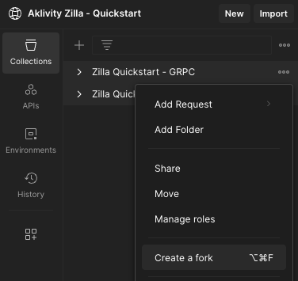

# Zilla Quickstart

Get started using Zilla by deploying our Docker Compose stack. Before proceeding, you need to run these quickstarts in an environment [with Docker Compose](https://docs.docker.com/compose/gettingstarted/).

## Run Zilla and the Compose Stack

Download the [zilla.quickstart](https://github.com/aklivity/zilla-examples/tree/main/zilla.quickstart) folder from the zilla-examples repo. The docker compose file will spin up everything you need for this quickstart. The `setup.sh` script will start and restart the backend. The `teardown.sh` script stops and destroys all of the containers.

::: code-tabs#bash

@tab Start and Restart


```bash
./setup.sh
```

@tab Shutdown

```bash
./teardown.sh
```

:::


## Fork Postman Collections

This quickstart is designed to be used from our public [Postman Workspace](https://www.postman.com/aklivity-zilla/workspace/aklivity-zilla-quickstart/overview). Fork both of these collections into your own workspace:

- [Zilla Quickstart - HTTP](https://www.postman.com/aklivity-zilla/workspace/aklivity-zilla-quickstart/collection/28401168-6941d1fa-698c-4da1-9789-2f806acf9fbb?action=share&creator=28401168)
- [Zilla Quickstart - GRPC](https://www.postman.com/aklivity-zilla/workspace/aklivity-zilla-quickstart/collection/64a85751808733dd197c599f?action=share&creator=28401168)



::: note App or Desktop Agent
Once the collections are forked you can run them against the local stack if you have either the [Postman App](https://www.postman.com/downloads/) or [Postman Desktop Agent](https://www.postman.com/downloads/postman-agent/) installed.
:::


## Browse the Kafka topics

This Zilla quickstart hosts a UI for the Kafka cluster. Go to [the topics page](http://localhost/ui/clusters/local/all-topics) to browse the data.

- **items-crud** - HTTP CRUD messages
- **events-sse** - SSE event messages
- **echo-service-messages** - gRPC echo messages
- **route-guide-requests** - gRPC RouteGuide requests
- **route-guide-responses** - gRPC RouteGuide responses

## Zilla Quickstart - HTTP

### CRUD Kafka Proxy

Zilla can expose the common entity CRUD endpoints where the data is being stored on Kafka topics. Leveraging the `cleanup.policy=compact` feature of Kafka, Zilla enables a standard REST backend architecture with Kafka as the storage layer. The `Idempotency-Key` header in the HTTP request will set the `key` on the topic and acts as the `ID` for the record.

- **GET** - Fetches all items on the topic or Fetch one item by its key using `/:key`.
- **POST** - Create a new item with the `Idempotency-Key` header setting the key. A UUID is generated if no key header is sent.
- **PUT** - Update an item based on its key using `/:key`.
- **DELETE** - Delete an item based on its key using `/:key`.

### SSE Kafka Proxy

Zilla can expose a Kafka topic as a Server-sent Events (SSE) stream, enabling a resilient event-driven architecture to be exposed over HTTP. This quickstart will demonstrate streaming data to one session while posting data from another using Zilla and Kafka as the backend.

- **GET** - Fetches all events on the topic.
- **POST** - Push a new event.
- **GET:SSE** - Stream all of the events published on the Kafka topic.

## Zilla Quickstart - GRPC

Zilla supports the gRPC protocol to proxy existing services and can use a Protobuf service definition to expose the defined methods and proxy those message binaries onto and off of Kafka topics.

### gRPC server proxy

Zilla can route individual service methods. The `GetFeature` method of this quickstart is proxied directly to the running RouteGuide server. This server enables `gRPC reflection`, which is being used for this request in the quickstart.

- **GetFeature** - Proxy gRPC directly to the server.

### gRPC Kafka proxy

Zilla maps the proto service method's request and response messages directly to Kafka topics. This can include simple RPC request-response method messages, but this quickstart demonstrates `Server-side`, `Client-side`, and `Bidirectional` streaming RPC to a running gRPC server through the `ListFeature`, `RecordRoute`, and `RouteChat`, respectively. Zilla is routing all of the messages from the client to the server through Kafka. You can match the individual service calls on the [topics](#browse-the-kafka-topics) by the matching `key` UUIDs which come from the `zilla:correlation-id` header.


- **RouteGuide** - Proxy messages through Kafka to a running gRPC server.
- **EchoService** - Zilla implements a simple message echo service.


## Check out the Prometheus Metrics

This Zilla quickstart collects basic metrics for the [streaming](../../reference/config/telemetry/metrics/metric-stream.md), [HTTP](../../reference/config/telemetry/metrics/metric-http.md), and [gRPC](../../reference/config/telemetry/metrics/metric-grpc.md) services. Go to [http://localhost:9090/metrtics](http://localhost:9090/metrtics) to see the collected data.

## Going Deeper

Try out the other [Zilla examples](https://github.com/aklivity/zilla-examples) to learn more about what Zilla can do.
