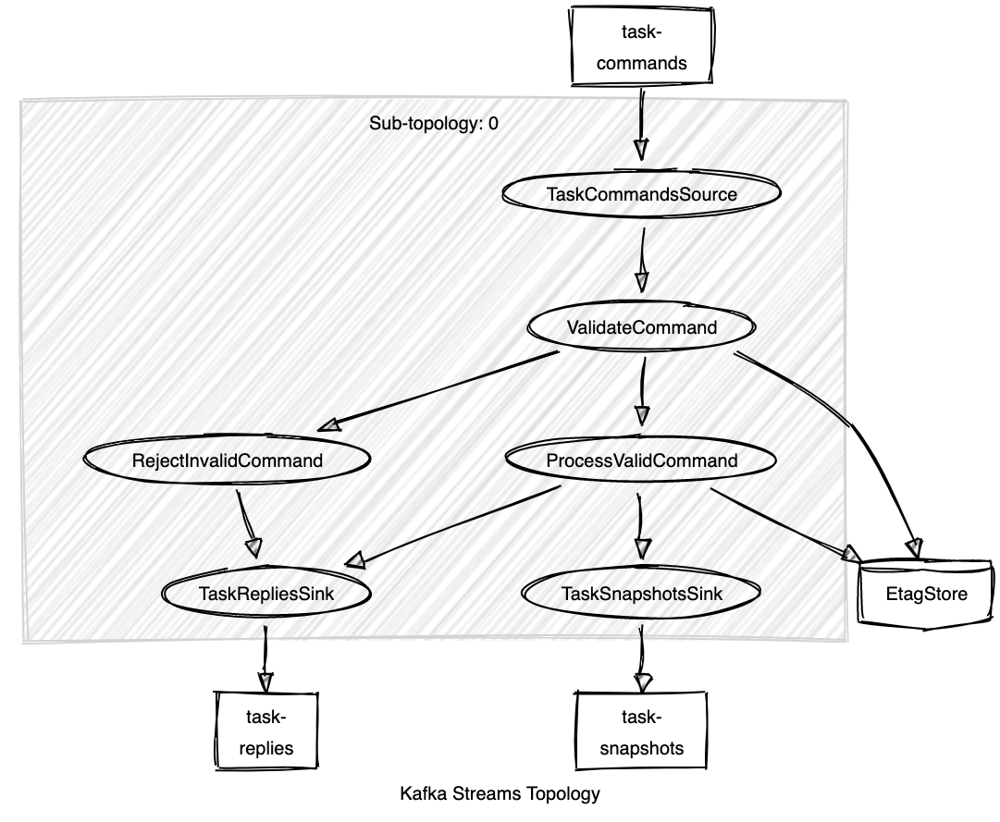
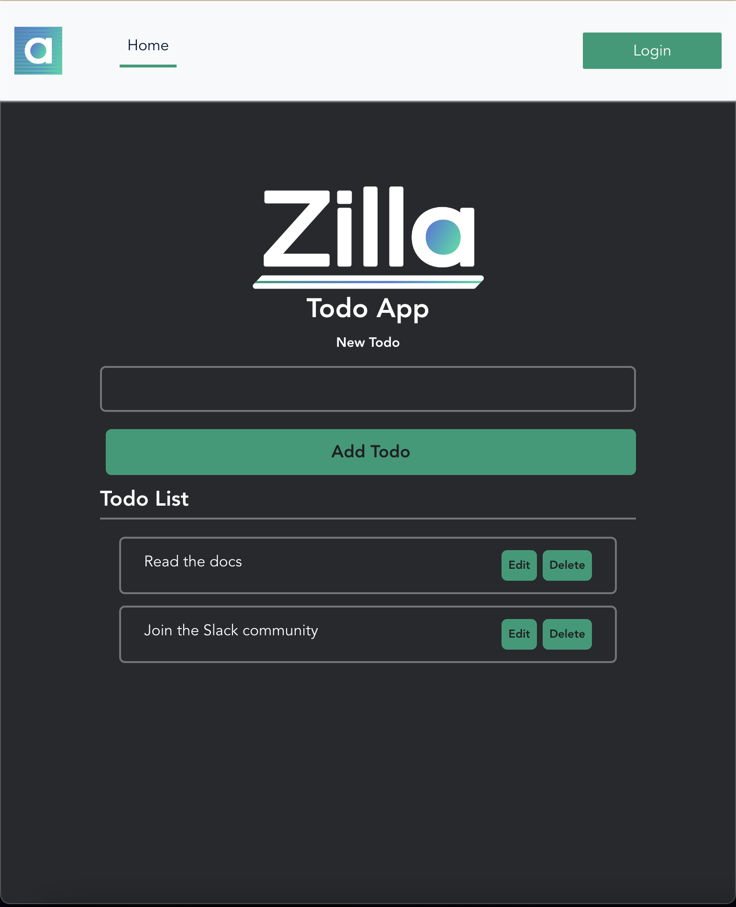

# Build the Todo Application

In this getting started exercise, you will create a simple Todo application using a CQRS design pattern that's backed by Apache Kafka and Zilla as the event-driven API gateway. Zilla lets you focus on your applications and business logic instead of spending time writing tons of code and this demo helps to ease CQRS complexity. This tutorial gives a basic introduction to Zilla and describes some straightforward capabilities.


This Todo Application tutorial has the following goals:

* Provide a list of Todo tasks that is shared by all clients
* Support optimistic locking with conflict detection when attempting to update a Todo task
* Deliver updates in near real-time when a Todo task is created, modified, or deleted
* Demonstrate a user interface driving the Tasks API
* Support scaling Todo task reads and writes

### Prerequisites

* Docker `20.10.14`
* Git `2.32.0`
* npm `8.3.1`  and above

### Step 1: Kafka (or Redpanda)

In this step, you will set up basic infrastructure components for your event-driven architecture.

::: info NOTE
Run `docker swarm init if you already haven't done to initiate`Swarm orchestrator.
:::

Let's create `stack.yml` and add `Apache Kafka` (or `Redpanda`).

::: code-tabs#shell

@tab Apache Kafka
```yaml stack.yml
version: "3"

networks:
  net0:
    driver: overlay

services:

  kafka:
    image: "bitnami/kafka:3.1.0"
    hostname: "kafka.internal.net"
    networks:
      - net0
    command:
      - 'sh'
      - '-c'
      - '/opt/bitnami/scripts/kafka/setup.sh && kafka-storage.sh format --config "$${KAFKA_CONF_FILE}" --cluster-id "lkorDA4qT6W1K_dk0LHvtg" --ignore-formatted  && /opt/bitnami/scripts/kafka/run.sh' # Kraft specific initialise
    environment:
      - ALLOW_PLAINTEXT_LISTENER=yes
      - KAFKA_CFG_NODE_ID=1
      - KAFKA_CFG_BROKER_ID=1
      - KAFKA_CFG_CONTROLLER_QUORUM_VOTERS=1@127.0.0.1:9093
      - KAFKA_CFG_LISTENER_SECURITY_PROTOCOL_MAP=CLIENT:PLAINTEXT,INTERNAL:PLAINTEXT,CONTROLLER:PLAINTEXT
      - KAFKA_CFG_CONTROLLER_LISTENER_NAMES=CONTROLLER
      - KAFKA_CFG_LOG_DIRS=/tmp/logs
      - KAFKA_CFG_PROCESS_ROLES=broker,controller
      - KAFKA_CFG_LISTENERS=CLIENT://:9092,INTERNAL://:29092,CONTROLLER://:9093
      - KAFKA_CFG_INTER_BROKER_LISTENER_NAME=INTERNAL
      - KAFKA_CFG_ADVERTISED_LISTENERS=CLIENT://localhost:9092,INTERNAL://kafka.internal.net:29092
    ports:
      - "9092:9092"
  init-topics:
    image: "bitnami/kafka:3"
    networks:
      - net0
    deploy:
      restart_policy:
        condition: none
        max_attempts: 0
    depends_on:
      - kafka
    entrypoint: [ '/bin/sh', '-c' ]
    command: |
      "
      # blocks until Kafka becomes reachable
      /opt/bitnami/kafka/bin/kafka-topics.sh --bootstrap-server kafka.internal.net:29092 --list --topic 'task-.*'
      
      echo '## Creating the Kafka topics'
      /opt/bitnami/kafka/bin/kafka-topics.sh --bootstrap-server kafka.internal.net:29092 --create --if-not-exists --topic task-commands --partitions 1
      /opt/bitnami/kafka/bin/kafka-topics.sh --bootstrap-server kafka.internal.net:29092 --create --if-not-exists --topic task-replies --partitions 1
      /opt/bitnami/kafka/bin/kafka-topics.sh --bootstrap-server kafka.internal.net:29092 --create --if-not-exists --topic task-snapshots --config cleanup.policy=compact --partitions 1
      echo ''
      echo '## Created the Kafka topics'
      /opt/bitnami/kafka/bin/kafka-topics.sh --bootstrap-server kafka.internal.net:29092 --list --topic 'task-.*'
      "
```

@tab Redpanda

```yaml stack.yml
version: "3"

networks:
  net0:
    driver: overlay

services:

  redpanda:
    image: 'docker.vectorized.io/vectorized/redpanda:v22.3.4'
    hostname: "kafka.internal.net"
    command:
      - redpanda
      - start
      - '--smp'
      - '1'
      - '--reserve-memory'
      - 0M
      - '--overprovisioned'
      - '--node-id'
      - '0'
      - '--kafka-addr'
      - 'INSIDE://0.0.0.0:29092,OUTSIDE://0.0.0.0:9092'
      - '--advertise-kafka-addr'
      - 'INSIDE://redpanda:29092,OUTSIDE://localhost:9092'
    networks:
      - net0
    ports:
      - '9092:9092'
      - '29092:29092'
      - '9644:9644'

  init-topics:
    image: 'docker.vectorized.io/vectorized/redpanda:v22.3.4'
    networks:
      - net0
    deploy:
      restart_policy:
        condition: none
        max_attempts: 0
    depends_on:
      - redpanda
    entrypoint: [ '/bin/sh', '-c' ]
    command: |
      "
      # blocks until Redpanda becomes reachable
      while ! rpk cluster status --brokers kafka.internal.net:29092
      do
        sleep 1
      done
      
      echo '## Creating the Redpanda topics'
      rpk topic create --brokers kafka.internal.net:29092 --partitions 1 task-commands
      rpk topic create --brokers kafka.internal.net:29092 --partitions 1 task-replies
      rpk topic create --brokers kafka.internal.net:29092 --partitions 1 --config cleanup.policy=compact task-snapshots

      echo ''
      echo '## Created the Redpanda topics'
      rpk topic list --brokers kafka.internal.net:29092 --regex 'task-.*'
      "
```
:::

Now let's run

```bash
docker stack deploy -c stack.yml example --resolve-image never
```

&#x20;to spin up `Apache Kafka` (or `Redpanda`) and create the following topics.

|                  |                      |
| ---------------- | -------------------- |
| `task-commands`  | Queues commands to be processed by the Todo service |
| `task-replies`   | Queues the response from the Todo service after processing each command |
| `task-snapshots` | Captures the latest snapshot of each task entity |

Now verify that the Kafka topics have been successfully created.

```bash
docker service logs example_init-topics --follow --raw
```

Make sure you see this output at the end of the `example_init-topics` service logs.

::: code-tabs#shell

@tab Apache Kafka

```bash
## Creating the Kafka topics
Created topic task-commands.
Created topic task-replies.
Created topic task-snapshots.

## Created the Kafka topics
task-commands
task-replies
task-snapshots
```

@tab Redpanda

```bash
CLUSTER
=======
redpanda.initializing

BROKERS
=======
ID    HOST      PORT
0*    redpanda  29092

## Creating the Redpanda topics
TOPIC          STATUS
task-commands  OK
TOPIC         STATUS
task-replies  OK
TOPIC           STATUS
task-snapshots  OK

## Created the Redpanda topics
NAME            PARTITIONS  REPLICAS
task-commands   1           1
task-replies    1           1
task-snapshots  1           1
```

:::

### Step 2: Todo Service

Next, you will need to build a todo service that is implemented using `Spring boot + Kafka Streams` to process commands and generate relevant output.  This `Todo` service can deliver near real-time updates when a `Task` is created, renamed, or deleted, and produces a message to the Kafka `task-snapshots` topic with the updated value.

Combining this with `cleanup-policy: compact` for the `task-snapshots` topic causes the topic to behave more like a table, where only the most recent message for each distinct message key is retained.

This approach is used as the source of truth for the current state of our `Todo` service, setting the Kafka message key to the Task identifier to retain all the distinct Tasks.

When a Task is deleted, you will produce a tombstone message (`null` value) to the `task-snapshots` topic causing that Task identifier to no longer be retained in Kafka.

Commands arrive at the Tasks service via the `task-commands` topic and correlated replies are sent to the `task-replies` topic with the same `zilla:correlation-id` value that was received with the inbound command message.

Implementing the Todo domain using these topics gives us the following Kafka Streams topology.



The `ValidateCommand` Kafka Streams processor implements optimistic locking by ensuring that conditional requests using `if-match` are allowed to proceed only if the latest `etag` for the Task matches, otherwise the command is rejected.

Let's checkout and build the service by running the commands below.

```bash
git clone https://github.com/aklivity/todo-service
cd todo-service
./mvnw clean install
cd ..
```

This will checkout and build `todo-service:latest` image.

Open `stack.yml` file and add the Todo service into the stack:

### stack.yml

```yaml
  ...
  
  todo-service:
    image: "todo-service:latest"
    networks:
      - net0
    environment:
      SPRING_KAFKA_APPLICATION_ID: todo-service
      SPRING_KAFKA_BOOTSTRAP_SERVERS: kafka.internal.net:29092
      TASK_COMMANDS_TOPIC: task-commands
      TASK_SNAPSHOTS_TOPIC: task-snapshots
      TASK_REPLIES_TOPIC: task-replies
```

Run the command below to deploy the `todo-service` to your existing stack.

```bash
docker stack deploy -c stack.yml example --resolve-image never
```

Output:
::: code-tabs#shell

@tab Apache Kafka

```bash
Creating service example_todo-service
Updating service example_kafka (id: st4hq1bwjsom5r0jxnc6i9rgr)
```

@tab Redpanda

```bash
Creating service example_todo-service
Updating service example_redpanda (id: ilmfqpwf35b7ftd6cvzdis8au)
```

:::

Now, you have a running to-do service that can process incoming commands, send a response and take snapshots of the task.

### Step 3: Zilla

Next, the most exciting and most challenging part of implementing the CQRS design pattern is where you need to build and deploy your API with a real-time response.

In a traditional approach, you would have to set up and build multiple layers of service implementation to expose the API that is based on Kafka Streams.

However, Zilla is designed to solve these architectural challenges, requiring only declarative configuration as shown below.

Let's design the Tasks API. You need to define a Tasks API to send commands to the `Todo` service via Kafka and retrieve task queries from Kafka as needed by the Tasks UX.


::: details

Creates a new Todo Task.&#x20;


Requires `content-type` `application/json` and request body matching `CreateTask` command domain model.

Include `idempotency-key` of type `uuid` to support idempotent `CreateTask`.

**Responses:**

**201: Created** - Task created successfully

:::


::: details


**Rename Task**

Renames a Todo Task.

Requires `content-type` `application/json` and request body matching `RenameTask` command domain model.

Include `idempotency-key` of type `uuid` to support idempotent `RenameTask`.

Include `if-match` with current `etag` to provide optimistic locking.

**Parameters**

**Path:**

id\[String] - Task identifier

**Header:**

if-match\[String] - Task etag


**Responses:**

* **204 No Content** - Task renamed successfully
* **412 Precondition Failed** - Task rename failed, etag does not match

:::


::: details

**Delete Task**

Requires `content-type` `application/json` and request body matching `DeleteTask` command domain model.

Include `idempotency-key` of type `uuid` to support idempotent `DeleteTask`.

Include `if-match` with current `etag` to provide optimistic locking.

**Parameters**

**Path:**

id\[String] - Task identifier

**Header:**

if-match\[String] - Task etag


**Responses:**

* **204 No Content** - **** Task deleted successfully
* **412 Precondition Failed** - **** Task delete failed, etag does not match

:::


::: details

**Get Tasks**

Retrieves all tasks, with `etag` representing the **** latest value.

**Parameters**

**Header:**

if-none-match\[String] - Tasks collection etag


**Responses:**

* **200 OK** - Returns an array of Tasks
* **304 Not Modified** - **** If Tasks collection etag matches

:::

#### Configure Zilla

The Zilla engine configuration defines a flow of named `bindings` representing each step in the pipeline as inbound network traffic is decoded and transformed then encoded into outbound network traffic as needed.

Let's configure `Zilla` for the Tasks API to interact with the `Todo` Kafka Streams service via Kafka topics.

You will add the following bindings to support the Tasks API as shown `zilla.yaml` below. To understand each binding type in more detail please visit [Zilla Runtime Configuration](https://docs.aklivity.io/zilla/reference/zilla.json).
|                       |                      |
| --------------------- | -------------------- |
| `tcp_server0`         | listens on port 8080 routes to http_server0 |
| `http_server0`        | decodes HTTP protocol routes Tasks API to http_kafka_proxy0 |
| `http_kafka_proxy0`   | transforms HTTP to Kafka routes POST, PUT and DELETE Tasks API requests to task-commands topic with task-replies reply-to topic via kafka_cache_client0 routes GET Tasks API requests to task-snapshots topic via kafka_cache_client0 |
| `kafka_cache_client0` | reads from local Kafka topic message cache routes to kafka_cache_server0 |
| `kafka_cache_server0` | writes to local Kafka topic message cache as new messages arrive from Kafka routes to kafka_client0 |
| `kafka_client0`       | encodes Kafka protocol routes to kafka_client0 |
| `tcp_client0`         | connects to Kafka brokers |

Using [Zilla Studio](https://zilla-studio.aklivity.io/), select the `Build the Todo App` template from the `Load Template` dropdown and then press `Generate Config` to download the corresponding `zilla.yaml` configuration file.


Alternatively, copy the contents of `zilla.yaml` shown below to your local `zilla.yaml` file.

::: details zilla.yaml

```yaml
---
name: Example
vaults: {}
bindings:
  tcp_serverab9279f6-00aa-40a9-b10a-268c5ebfd800:
    type: tcp
    kind: server
    options:
      host: 0.0.0.0
      port: 8080
    exit: http_serverab9279f6-00aa-40a9-b10a-268c5ebfd800
  http_serverab9279f6-00aa-40a9-b10a-268c5ebfd800:
    type: http
    kind: server
    options:
      access-control:
        policy: cross-origin
    routes:
      - when:
          - headers:
              :method: GET
              :path: /tasks
        exit: sse_serverab9279f6-00aa-40a9-b10a-268c5ebfd800
      - when:
          - headers:
              :method: POST
              :path: /tasks
          - headers:
              :method: PUT
              :path: /tasks/*
          - headers:
              :method: DELETE
              :path: /tasks/*
        exit: http-kafka_proxyab9279f6-00aa-40a9-b10a-268c5ebfd800
  sse_serverab9279f6-00aa-40a9-b10a-268c5ebfd800:
    type: sse
    kind: server
    exit: sse-kafka_proxyab9279f6-00aa-40a9-b10a-268c5ebfd800
  sse-kafka_proxyab9279f6-00aa-40a9-b10a-268c5ebfd800:
    type: sse-kafka
    kind: proxy
    routes:
      - when:
          - path: /tasks
        exit: kafka_cache_clientda6b9d8f-0846-4b2b-8ed6-b8db5605e50c
        with:
          event:
            id: '["${base64(key)}","${etag}"]'
          topic: task-snapshots
  http-kafka_proxyab9279f6-00aa-40a9-b10a-268c5ebfd800:
    type: http-kafka
    kind: proxy
    routes:
      - when:
          - method: POST
            path: /tasks
        exit: kafka_cache_clientda6b9d8f-0846-4b2b-8ed6-b8db5605e50c
        with:
          capability: produce
          reply-to: task-replies
          topic: task-commands
          key: ${idempotencyKey}
          overrides:
            zilla:domain-model: CreateTaskCommand
      - when:
          - method: PUT
            path: /tasks/{id}
        exit: kafka_cache_clientda6b9d8f-0846-4b2b-8ed6-b8db5605e50c
        with:
          capability: produce
          reply-to: task-replies
          topic: task-commands
          key: ${params.id}
          overrides:
            zilla:domain-model: RenameTaskCommand
      - when:
          - method: DELETE
            path: /tasks/{id}
        exit: kafka_cache_clientda6b9d8f-0846-4b2b-8ed6-b8db5605e50c
        with:
          capability: produce
          reply-to: task-replies
          topic: task-commands
          key: ${params.id}
          overrides:
            zilla:domain-model: DeleteTaskCommand
  kafka_cache_clientda6b9d8f-0846-4b2b-8ed6-b8db5605e50c:
    type: kafka
    kind: cache_client
    exit: kafka_cache_serverda6b9d8f-0846-4b2b-8ed6-b8db5605e50c
  kafka_cache_serverda6b9d8f-0846-4b2b-8ed6-b8db5605e50c:
    type: kafka
    kind: cache_server
    options:
      bootstrap:
        - task-replies
        - task-snapshots
    exit: kafka_clientda6b9d8f-0846-4b2b-8ed6-b8db5605e50c
  kafka_clientda6b9d8f-0846-4b2b-8ed6-b8db5605e50c:
    type: kafka
    kind: client
    exit: tcp_clientda6b9d8f-0846-4b2b-8ed6-b8db5605e50c
  tcp_clientda6b9d8f-0846-4b2b-8ed6-b8db5605e50c:
    type: tcp
    kind: client
    options:
      host: kafka.internal.net
      port: 29092
    routes:
      - when:
          - cidr: 0.0.0.0/0
guards: {}
```

:::

Now let's add the `zilla` service to the docker stack, mounting the `zilla.yaml` configuration.

```yaml
  ...
  
  zilla:
    image: "ghcr.io/aklivity/zilla:latest"
    hostname: "zilla"
    command: ["start", "-v", "-e"]
    volumes:
      - ./zilla.yaml:/etc/zilla/zilla.yaml:ro
    networks:
      - net0
    ports:
      - "8080:8080"
  ...
```

Run the below command as this will deploy the `zilla` service to the existing stack.

```bash
docker stack deploy -c stack.yml example --resolve-image never
```

::: code-tabs#shell

@tab Apache Kafka

```bash
Updating service example_kafka (id: st4hq1bwjsom5r0jxnc6i9rgr)
Updating service example_todo-service (id: ojbj2kbuft22egy854xqv8yo8)
Creating service example_zilla
```

@tab Redpanda

```bash
Updating service example_redpanda (id: ilmfqpwf35b7ftd6cvzdis8au)
Updating service example_todo-service (id: 1tq9nktlvcwxeh3wzhmj02cvd)
Creating service example_zilla
```

:::

::: info NOTE
Make sure that Zilla is fully started by checking container logs where you see **started** at the end of the log.
:::

Let's verify the Tasks API using the `curl` `POST` and `GET` commands shown below.

```bash
curl -X POST http://localhost:8080/tasks \
  -H "Idempotency-Key: 5958F9A2-8319-486B-BD43-2F80FDE87223" \
  -H "Content-Type: application/json" \
  -d "{\"name\":\"Read the docs\"}"
```

```bash
curl http://localhost:8080/tasks
```

```bash
id:["NTk1OEY5QTItODMxOS00ODZCLUJENDMtMkY4MEZERTg3MjIz","AQIAAg==/1"]
data:{"name":"Read the docs"}
```

As you can see, the `GET /tasks` API delivers a continuous stream of tasks starting with the initial tasks as expected.

Now create a new Todo task while keeping the `GET /tasks` stream open as shown above.

```bash
curl -X POST http://localhost:8080/tasks \
  -H "Idempotency-Key: 5C1A90A3-AEB5-496F-BA00-42D1D805B21B" \
  -H "Content-Type: application/json" \
  -d "{\"name\":\"Join the Slack community\"}"
```

The `GET /tasks` stream automatically receives the update when the new task is created.

```bash
id:["NUMxQTkwQTMtQUVCNS00OTZGLUJBMDAtNDJEMUQ4MDVCMjFC","AQIABA==/1"]
data:{"name":"Join the Slack community"}

```

Each new update arrives automatically, even when changes are made by other clients.

### Step 4: Web App

Next, you will build the `Todo` app that's implemented using [VueJs](https://vuejs.org/) framework.  Run the commands below in the root directory.

```bash
git clone https://github.com/aklivity/todo-app && \
cd todo-app && \
npm install && \
npm run build && \
cd ..
```

This will generate `dist` folder with necessary artifacts. Now you can configure Zilla to host the app so that both API and app can be served under the same hostname and port.

First, add the `http_filesystem_proxy0` and `filesystem_server0` bindings to `zilla.yaml` giving the following updated configuration.

::: details zilla.yaml (updated)

```yaml
---
name: Example
vaults: {}
bindings:
  tcp_serverab9279f6-00aa-40a9-b10a-268c5ebfd800:
    type: tcp
    kind: server
    options:
      host: 0.0.0.0
      port: 8080
    exit: http_serverab9279f6-00aa-40a9-b10a-268c5ebfd800
  http_serverab9279f6-00aa-40a9-b10a-268c5ebfd800:
    type: http
    kind: server
    options:
      access-control:
        policy: cross-origin
    routes:
      - when:
          - headers:
              :method: GET
              :path: /tasks
        exit: sse_serverab9279f6-00aa-40a9-b10a-268c5ebfd800
      - when:
          - headers:
              :method: POST
              :path: /tasks
          - headers:
              :method: PUT
              :path: /tasks/*
          - headers:
              :method: DELETE
              :path: /tasks/*
        exit: http-kafka_proxyab9279f6-00aa-40a9-b10a-268c5ebfd800
    exit: http_filesystem_proxy0
  sse_serverab9279f6-00aa-40a9-b10a-268c5ebfd800:
    type: sse
    kind: server
    exit: sse-kafka_proxyab9279f6-00aa-40a9-b10a-268c5ebfd800
  sse-kafka_proxyab9279f6-00aa-40a9-b10a-268c5ebfd800:
    type: sse-kafka
    kind: proxy
    routes:
      - when:
          - path: /tasks
        exit: kafka_cache_clientda6b9d8f-0846-4b2b-8ed6-b8db5605e50c
        with:
          event:
            id: '["${base64(key)}","${etag}"]'
          topic: task-snapshots
  http-kafka_proxyab9279f6-00aa-40a9-b10a-268c5ebfd800:
    type: http-kafka
    kind: proxy
    routes:
      - when:
          - method: POST
            path: /tasks
        exit: kafka_cache_clientda6b9d8f-0846-4b2b-8ed6-b8db5605e50c
        with:
          capability: produce
          reply-to: task-replies
          topic: task-commands
          key: ${idempotencyKey}
          overrides:
            zilla:domain-model: CreateTaskCommand
      - when:
          - method: PUT
            path: /tasks/{id}
        exit: kafka_cache_clientda6b9d8f-0846-4b2b-8ed6-b8db5605e50c
        with:
          capability: produce
          reply-to: task-replies
          topic: task-commands
          key: ${params.id}
          overrides:
            zilla:domain-model: RenameTaskCommand
      - when:
          - method: DELETE
            path: /tasks/{id}
        exit: kafka_cache_clientda6b9d8f-0846-4b2b-8ed6-b8db5605e50c
        with:
          capability: produce
          reply-to: task-replies
          topic: task-commands
          key: ${params.id}
          overrides:
            zilla:domain-model: DeleteTaskCommand
  kafka_cache_clientda6b9d8f-0846-4b2b-8ed6-b8db5605e50c:
    type: kafka
    kind: cache_client
    exit: kafka_cache_serverda6b9d8f-0846-4b2b-8ed6-b8db5605e50c
  kafka_cache_serverda6b9d8f-0846-4b2b-8ed6-b8db5605e50c:
    type: kafka
    kind: cache_server
    options:
      bootstrap:
        - task-replies
        - task-snapshots
    exit: kafka_clientda6b9d8f-0846-4b2b-8ed6-b8db5605e50c
  kafka_clientda6b9d8f-0846-4b2b-8ed6-b8db5605e50c:
    type: kafka
    kind: client
    exit: tcp_clientda6b9d8f-0846-4b2b-8ed6-b8db5605e50c
  tcp_clientda6b9d8f-0846-4b2b-8ed6-b8db5605e50c:
    type: tcp
    kind: client
    options:
      host: kafka.internal.net
      port: 29092
    routes:
      - when:
          - cidr: 0.0.0.0/0
  http_filesystem_proxy0:
    type: http-filesystem
    kind: proxy
    routes:
      - when:
          - path: /
        exit: filesystem_server0
        with:
          path: index.html
      - when:
          - path: /{path}
        exit: filesystem_server0
        with:
          path: ${params.path}
  filesystem_server0:
    type: filesystem
    kind: server
    options:
      location: /app/dist/
guards: {}
```

:::

The last step is to mount the `dist` folder into the `Zilla` container.

Open `stack.yml` file and add `- ./todo-app/dist:/app/dist:ro` to the `zilla` service `volumes`.

#### stack.yml
```yaml
  ...
  
  zilla:
    image: "ghcr.io/aklivity/zilla:latest"
    hostname: "zilla"
    command: ["start", "-v", "-e"]
    volumes:
      ...
      - ./todo-app/dist:/app/dist:ro

  ...
```

Finally, run

```bash
docker stack deploy -c stack.yml example --resolve-image never
```

Make sure that `zilla.yaml`  config changes got applied after restarting the `Zilla` service. Check the `example_zilla` service log.

### Step 5: Test Drive!

Open the browser and enter [`http://localhost:8080/`](http://localhost:8080/) to see the Todo Application.



Notice that there is no need to `Login` as the Tasks API is initially available to anonymous clients.

Next up: [Secure the Todo Application](secure-todo-app.md) Tasks API with JWT access tokens.
