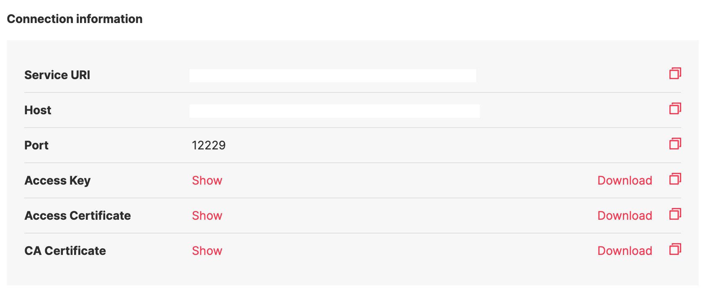

# Aiven

## Introduction

In this guide, you will learn how to connect to Aiven Kafka from Zilla. You can get started with a fully working config [example](https://github.com/aklivity/zilla-examples/blob/main/http.kafka.cache/).

A brief explanation of replaceable values from the config examples below:

| Value                       | Description                                                              |
| --------------------------- | ------------------------------------------------------------------------ |
| `TRUSTORE_PATH`             | The path to the `truststore` that stores CA cert that you want to trust. |
| `TRUSTORE_PASSWORD`         | Truststore password.                                                     |
| `KEYSTORE_PATH`             | The path to the `keystore` that stores access key.                       |
| `KEYSTORE_PASSWORD`         | Keystore password.                                                       |
| `STORE_TYPE`                | Keystore types such as `pkcs12`, `jceks`, and etc                        |
| `CA_CERT_ALIAS`             | Unique string that identifies the certificate entry in the truststore.   |
| `SIGNED_CLIENT_CERT_ALIAS`  | A unique string that identifies the key cert entry chain in the keystore |
| `BOOTSTRAP_SERVER_HOSTNAME` | Target Kafka hostname                                                    |
| `BOOTSTRAP_SERVER_PORT`     | Target Kafka port number                                                 |

## Aiven Parameters

The Aiven Kafka requires clients to connect via `TLS mutual authentication` and provides the following files  `Client Key`, `Client Certificate`, and `CA Certificate` to achieve that. You can download them by going to `Aiven Console` -> `Kafka Cluster` -> `Overview Tab` as shown below.



you should have the following files:

* `service.key` - Access Key
* `service.cert` - Access Certificate
* `ca.pem` - CA Certificate

The next step is to generate the truststore and keystore.

* `truststore.p12` -  contains the trusted server certificates or certificate authorities
* `keystore.p12` -  contains the signed client certificates

You can use the scripts shown below to generate `truststore.p12` and `keystore.p12` files using certificates and keys downloaded from `Aiven Kafka Console`. Please replace all caps lock words.

::: code-tabs#bash

@tab truststore.p12

```bash:no-line-numbers
keytool -import -file ca.pem \
    -alias YOUR_KAFKA_SIGNED_CLIENT_CERT_ALIAS \
    -keystore truststore.p12
```

@tab keystore.p12

```bash:no-line-numbers
openssl pkcs12 -export -in service.cert -inkey service.key \
    -out keystore.p12 -name YOUR_KAFKA_CA_CERT_ALIAS \
    -CAfile ca.pem
```

:::

## Configure Zilla

And the final step is to configure a `vault`  with `truststore` and `keystore`, then reference the vault in the `tls_client` binding.

### zilla.yaml

::: code-tabs#yaml

@tab zilla.yaml

```yaml
vaults:
  client_vault:
    type: filesystem
    options:
      trust:
        store: TRUSTORE_PATH
        type: STORE_TYPE
        password: TRUSTORE_PASSWORD
      keys:
        store: KEYSTORE_PATH
        type: STORE_TYPE
        password: KEYSTORE_PASSWORD
bindings:
  kafka_client:
    type: kafka
    kind: client
    exit: tls_client
  tls_client:
    type: tls
    kind: client
    vault: client_vault
    options:
      trust:
        - CA_CERT_ALIAS
      keys:
        - SIGNED_CLIENT_CERT_ALIAS
      sni:
        - BOOTSTRAP_SERVER_HOSTNAME
    exit: tcp_client
  tcp_client:
    type: tcp
    kind: client
    options:
      host: BOOTSTRAP_SERVER_HOSTNAME
      port: BOOTSTRAP_SERVER_PORT
    routes:
      - when:
          - cidr: 0.0.0.0/0

```

:::

::: info NOTE
SNI adds the domain name to the TLS handshake process so that the Zilla process reaches the right domain name and receives the correct SSL certificate.
:::

To test the above config you can follow instructions in the README from the [example](https://github.com/aklivity/zilla-examples/blob/main/http.kafka.cache/).
