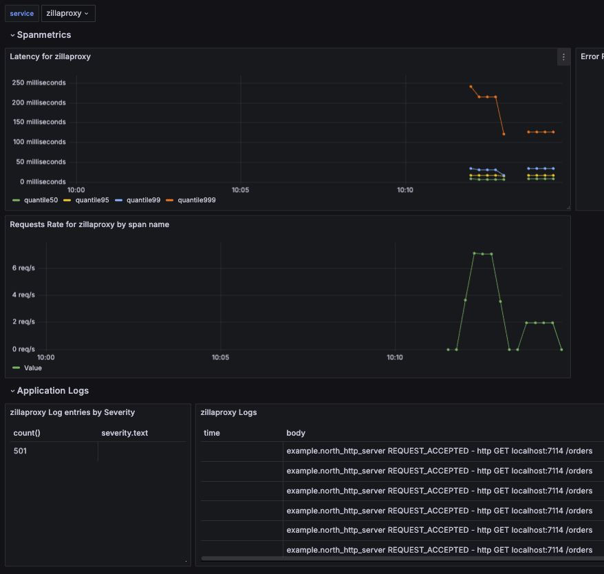

# Logs and Metrics via the OpenTelemetry Protocol

In this guide, you run the [aklivity/opentelemetry-demo](https://github.com/aklivity/opentelemetry-demo) and use Zilla to expose the Kafka topics as rest endpoints.

Specifically, you will:

[Verify prerequisites](#prerequisites) to run this guide.
[Install and run](#install-and-run) Zilla with the other OpenTelemetry demo components.
[Verify the web store and Telemetry Demo](#verify-the-web-store-and-telemetry-demo) is working.
[Fetch Kafka Messages](#fetch-kafka-messages) using Zilla.
[Browse the Observability data](#browse-the-observability-data) created and sent by Zilla.

## Prerequisites

Before proceeding, you should have [Compose](https://docs.docker.com/compose/gettingstarted/).

::: details Detailed prerequisites

- A connection to the internet
- Docker version 1.13.0+ or later is installed and running
- Docker Compose v2.0.0+
- Container host resources: 2 CPU, 6GB memory

:::

## Install and run

Download the [opentelemetry-demo](https://github.com/aklivity/opentelemetry-demo) repo. It will start Zilla and everything you need for this guide.

We have added a simple http proxy on the existing `orders` Kafka topic in the demo. In the `zilla.yaml` you can see the added `otlp` exporter and the demo environment variables used coming from the compose file.

::: code-tabs#yaml

@tab zilla.yaml

```yaml {26-36}
---
name: ${{ env.OTEL_SERVICE_NAME }}
telemetry:
  attributes:
    service.name: ${{ env.OTEL_SERVICE_NAME }}
    service.version: ${{ env.ZILLA_VERSION }}

  # Desired metrics to track
  metrics:
    - http.active.requests
    - http.duration
    - http.request.size
    - http.response.size
    - stream.active.received
    - stream.active.sent
    - stream.opens.received
    - stream.opens.sent
    - stream.data.received
    - stream.data.sent
    - stream.errors.received
    - stream.errors.sent
    - stream.closes.received
    - stream.closes.sent

  # Prometheus endpoint definition
  exporters:
    otel_exporter_otlp:
      type: otlp
      options:
        interval: 5
        signals:
          - metrics
          - logs
        endpoint:
          protocol: http
          location: ${{ env.OTEL_EXPORTER_OTLP_ENDPOINT }}

bindings:
  north_tcp_server:
    type: tcp
    kind: server
    options:
      host: 0.0.0.0
      port:
        - 7114
    routes:
      - when:
          - port: 7114
        exit: north_http_server
    telemetry:
      metrics:
        - stream.*
  north_http_server:
    type: http
    kind: server
    routes:
      - when:
          - headers:
              :scheme: http
              :authority: localhost:7114
        exit: north_http_kafka_mapping
    telemetry:
      metrics:
        - http.*
        - stream.*
  north_http_kafka_mapping:
    type: http-kafka
    kind: proxy
    routes:
      - when:
          - method: GET
            path: /{topic}
        exit: north_kafka_cache_client
        with:
          capability: fetch
          topic: ${params.topic}
          merge:
            content-type: application/json
    telemetry:
      metrics:
        - http.*
        - stream.*
  north_kafka_cache_client:
    type: kafka
    kind: cache_client
    exit: south_kafka_cache_server
    telemetry:
      metrics:
        - stream.*
  south_kafka_cache_server:
    type: kafka
    kind: cache_server
    exit: south_kafka_client
    telemetry:
      metrics:
        - stream.*
  south_kafka_client:
    type: kafka
    kind: client
    options:
      servers:
        - ${{ env.KAFKA_SERVICE_ADDR }}
    exit: south_tcp_client
    telemetry:
      metrics:
        - stream.*
  south_tcp_client:
    type: tcp
    kind: client
    telemetry:
      metrics:
        - stream.*

```

@tab docker-compose.yaml

```yaml {14-18}
...
  # Zilla
  zillaproxy:
    image: ghcr.io/aklivity/zilla:0.9.82
    container_name: zilla-proxy
    deploy:
      resources:
        limits:
          memory: 500M
    restart: unless-stopped
    ports:
      - "${ZILLA_PORT}:${ZILLA_PORT}"
    environment:
      - KAFKA_SERVICE_ADDR
      - OTEL_EXPORTER_OTLP_ENDPOINT=http://${OTEL_COLLECTOR_HOST}:${OTEL_COLLECTOR_PORT_HTTP}
      - OTEL_EXPORTER_OTLP_METRICS_TEMPORALITY_PREFERENCE
      - OTEL_RESOURCE_ATTRIBUTES
      - OTEL_SERVICE_NAME=zillaproxy
    volumes:
      - ./src/zillaproxy/zilla.yaml:/etc/zilla/zilla.yaml
    command: start -v -e
    healthcheck:
      test: nc -z zilla ${ZILLA_PORT}
      start_period: 10s
      interval: 5s
      timeout: 10s
      retries: 10
    depends_on:
      otelcol:
        condition: service_started
      kafka:
        condition: service_healthy
    logging: *logging
...
```

:::

Run the Demo using Docker Compose from inside the demo directory:

```bash:no-line-numbers
docker compose up --force-recreate --remove-orphans --detach
```

## Verify the web store and Telemetry Demo

Once the images are built and containers are started you can access:

- Web store: <http://localhost:8080/>
- Grafana: <http://localhost:8080/grafana/>
- [Grafana demo dashboard](http://localhost:8080/grafana/d/W2gX2zHVk/demo-dashboard?orgId=1&var-service=zillaproxy).

## Fetch Kafka Messages

The running `zillaproxy` is configured to expose kafka topics passed in through the path

- Zilla Proxy: <http://localhost:7114/{kafka_topic_name}>

You can fetch all of the messages on the Kafka topic from a `curl` command.

```bash:no-line-numbers
curl http://localhost:7114/orders
```

```output:no-line-numbers
[
$ea598bca-0ed4-11ef-91e2-0242c0a80014$adb1a413-2ac6-4c8d-9aff-bd8955273889
USD�    �ʵ�"4
United States*98109*leWA"


LS4PSXUNUM
USD9����* 


2ZYFJ3GM2N

USD�����* 


66VCHSJNUP
USD�����,
$ebed6139-0ed4-11ef-91e2-0242c0a80014$91b1d717-5aa8-4ee3-b401-c5942d7f9be5
USD����_"9
United States*95014*    CupertinoCA"


L9ECAV7KIM
USD����* 


66VCHSJNUP
USD�����]
```

Create lots of request with a `while` loop:

```bash:no-line-numbers
while true; do; curl http://localhost:7114/orders; done
```

## Browse the Observability data

You can see the `zillaproxy` service logs and metrics in the OpenTelemetry Demo's [Grafana demo dashboard](http://localhost:8080/grafana/d/W2gX2zHVk/demo-dashboard?orgId=1&var-service=zillaproxy).

The `http.duration` metrics are being used to track the Latency and Requests Rate sections of the dashboard. All of the event logs that zilla is exporting to `stdout` are in the Application Logs section.



## Teardown

You have seen Zilla successfully export metrics to an `otlp` collector. You can teardown the demo using the below command.

```bash:no-line-numbers
docker compose down
```
