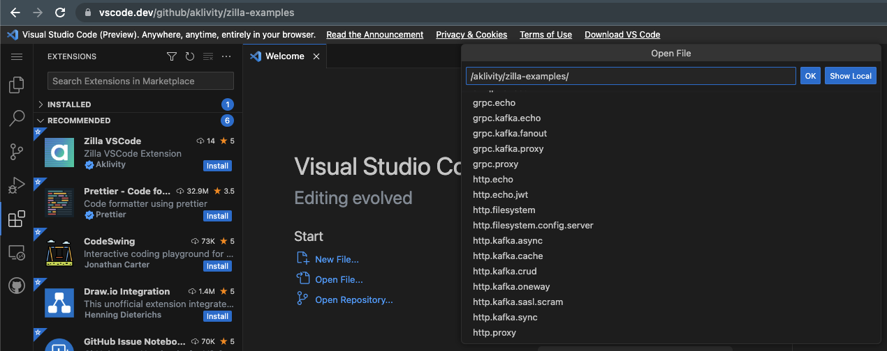
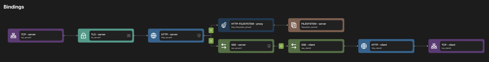
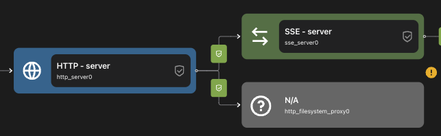
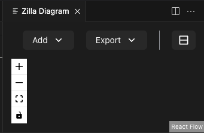
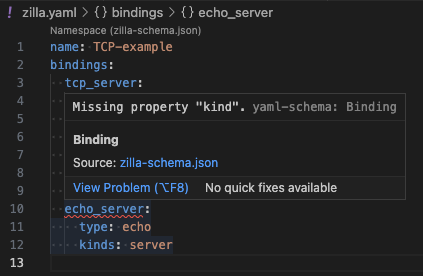
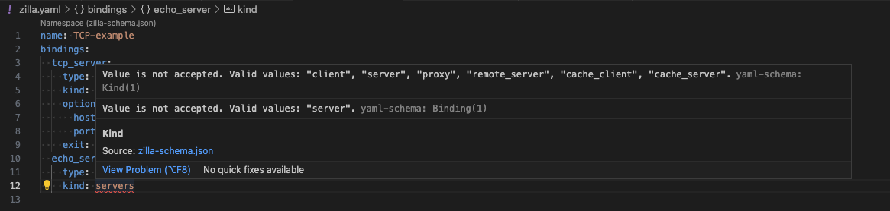
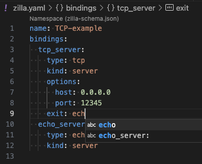

# VS Code extension

The Zilla Visual Studio Code extension enables you to manage your Zilla config files easily in VS Code.

## Introduction

The VS Code extension includes:

- [Zilla Diagram](#zilla-diagram), which provides a visual representation of your Zilla config similar to a network diagram. It displays all of the configured Zilla elements and how they connect.
- [Yaml IntelliSense](#yaml-intellisense), which helps you write and maintain your [zilla.yaml](../config/overview.md) config.

## Install the VS Code extension

For installation and setup instructions, visit the [VS Code Marketplace](https://marketplace.visualstudio.com/items?itemName=aklivity.zilla-vscode-ext), or search for the official Zilla extension on the Extensions tab in VS Code.

## Using vscode.dev

The Zilla extension can be installed on vscode.dev for those users who don't have it installed on their local environment.

- Go to [vscode.dev](https://vscode.dev/)
- Search for the `Zilla VSCode` extension and install it
- Create a file called `zilla.yaml`
- `Paste` your yaml and the extension will be able to render the diagram

### Browsing GitHub repos

- Go to [vscode.dev/github/aklivity/zilla-examples](https://vscode.dev/github/aklivity/zilla-examples) to open the `zilla-examples` repo in the browser.
- Sign in to GitHub.
- The Zilla extension will be in the `recommended extensions` section.
- Now you can open any of the `zilla.yaml` files from the examples.

## Zilla Diagram

The extension will render the active `zilla.yaml` file when the `Toggle Diagram View`  button in the top right corner is pressed.

- Clicking anywhere on the diagram will take your cursor to that location in the zilla.yaml file.
- the `?` icon that appears on a clicked element will take you to the appropriate docs page

- Missing connections and errors can be seen in the diagram view.

- The `Add` dropdown lets you create new elements in the zilla.yaml file.
- The `Export` dropdown lets you download your diagram.
- the View switch will toggle between side-by-side and top-bottom layouts.

## Yaml IntelliSense

- Property and Value validation highlighting

- Syntax and Context aware autocomplete

