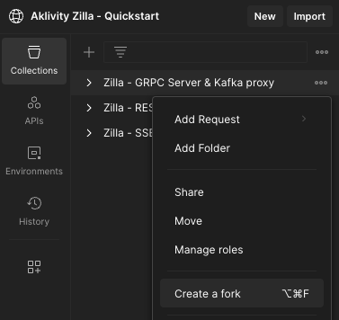

# Zilla Kafka Proxy Quickstart

Get started with Zilla by deploying our Docker Compose stack. Before proceeding, you should have [Docker Compose](https://docs.docker.com/compose/gettingstarted/) installed.

## Postman Collections

This quickstart uses Aklivity's public [Postman Workspace](https://www.postman.com/aklivity-zilla/workspace/aklivity-zilla-quickstart/overview) to give you a fast and easy way to try out Zilla's multi-protocol Kafka proxying capabilities.

::: note App or Desktop Agent
Once the collections are forked, you can run them against the local stack if you have either the [Postman App](https://www.postman.com/downloads/) or [Postman Desktop Agent](https://www.postman.com/downloads/postman-agent/) installed.
:::

Fork each of these collections into your personal/team workspace.

- [Zilla - REST Kafka proxy](https://www.postman.com/aklivity-zilla/workspace/aklivity-zilla-quickstart/overview)
- [Zilla - SSE Kafka proxy](https://www.postman.com/aklivity-zilla/workspace/aklivity-zilla-quickstart/overview)
- [Zilla - gRPC Kafka proxy](https://www.postman.com/aklivity-zilla/workspace/aklivity-zilla-quickstart/overview)
- [Zilla - MQTT Kafka proxy](https://www.postman.com/aklivity-zilla/workspace/aklivity-zilla-quickstart/overview)



## Zilla Docker Compose Stack

Download and run the Zilla [quickstart](https://github.com/aklivity/zilla-examples/tree/main/quickstart). This [startup.sh](https://github.com/aklivity/zilla-examples/releases/latest/download/startup.sh) script will start Zilla and everything you need for this quickstart. 

```bash:no-line-numbers
wget -qO- https://raw.githubusercontent.com/aklivity/zilla-examples/main/startup.sh | sh -
```

The key components this script will setup:

- Configured Zilla instance
- Kafka instance and topics
- [Kafka UI](http://localhost:8080/ui/clusters/local/all-topics) for browsing topics & messages
- gRPC Route Guide server
- MQTT message simulator

### Kafka topics

This Zilla quickstart hosts a UI for the Kafka cluster. To browse the data, go to the [topics page](http://localhost:8080/ui/clusters/local/all-topics).

Find the docker command in the `Verify the Kafka topics were created` section of the `startup.sh` script output. Verify these topics are listed:

- [items-crud](http://localhost:8080/ui/clusters/local/all-topics/items-crud/messages) - REST CRUD messages
- [events-sse](http://localhost:8080/ui/clusters/local/all-topics/events-sse/messages) - SSE event messages
- [echo-service-messages](http://localhost:8080/ui/clusters/local/all-topics/echo-service-messages/messages) - gRPC echo messages
- [route-guide-requests](http://localhost:8080/ui/clusters/local/all-topics/route-guide-requests/messages) - gRPC RouteGuide requests
- [route-guide-responses](http://localhost:8080/ui/clusters/local/all-topics/route-guide-responses/messages) - gRPC RouteGuide responses
- [iot-messages](http://localhost:8080/ui/clusters/local/all-topics/iot-messages/messages) - MQTT messages responses
- [iot-retained](http://localhost:8080/ui/clusters/local/all-topics/iot-retained/messages) - MQTT messages with the retained flag
- [iot-sessions](http://localhost:8080/ui/clusters/local/all-topics/iot-sessions/messages) - MQTT sessions

## REST Kafka proxy

Zilla can expose common entity CRUD endpoints with the entity data being stored on Kafka topics. Leveraging Kafka's `cleanup.policy=compact` feature, Zilla enables a standard REST backend architecture with Kafka as the storage layer. Adding an `Idempotency-Key` header during creation will set the message `key` and act as the `ID` for the record. A UUID is generated if no key is sent.

- **GET** - Fetches all items on the topic or Fetch one item by its key using `/:key`.
- **POST** - Create a new item with the `Idempotency-Key` header setting the key.
- **PUT** - Update an item based on its key using `/:key`.
- **DELETE** - Delete an item based on its key using `/:key`.

The [items-crud](http://localhost:8080/ui/clusters/local/all-topics/items-crud/messages) Kafka topic will have all the objects you posted, updated, and deleted.

::: note Going Deeper
Zilla can be configured for request-response over Kafka topics both synchronously and asynchronously, and more that we can't cover in this quickstart. Here are some other resources you will want to check out.

- [REST proxy guide](../../concepts/kafka-proxies/rest-proxy.md)
- [HTTP proxy example](https://github.com/aklivity/zilla-examples/tree/main/http.proxy)
- [JWT Auth example](https://github.com/aklivity/zilla-examples/tree/main/http.echo.jwt)
- [Kafka cache example](https://github.com/aklivity/zilla-examples/tree/main/http.kafka.cache)
- [Kafka sync example](https://github.com/aklivity/zilla-examples/tree/main/http.kafka.sync)
- [Kafka async example](https://github.com/aklivity/zilla-examples/tree/main/http.kafka.async)
:::

## SSE Kafka proxy

Zilla can expose a Kafka topic as a Server-sent Events (SSE) stream, enabling a resilient event-driven architecture to be exposed over HTTP. This quickstart will demonstrate streaming data to one session while posting data from another using Zilla and Kafka as the backend.

- **POST** - Push a new event.
- **GET:SSE** - Stream all of the events published on the `event-sse` Kafka topic.

The [events-sse](http://localhost:8080/ui/clusters/local/all-topics/events-sse/messages) Kafka topic will have a record of each new event sent over HTTP to the SSE stream.

::: note Going Deeper
Zilla can be configured for more use cases we can't cover in this quickstart. Here are some other interesting examples you will want to check out.

- [REST proxy guide](../../concepts/kafka-proxies/sse-proxy.md)
- [Kafka fanout example](https://github.com/aklivity/zilla-examples/tree/main/sse.kafka.fanout)
- [JWT Auth example](https://github.com/aklivity/zilla-examples/tree/main/sse.proxy.jwt)
:::

## gRPC Kafka proxy

Zilla maps the service method's request and response messages directly to Kafka topics. This can include simple RPC request-response messages, but this quickstart demonstrates `Simple-RPC`, `Server-side`, `Client-side`, and `Bidirectional` streaming RPC to a running gRPC server through the `GetFeature`, `ListFeature`, `RecordRoute`, and `RouteChat`, respectively. Zilla is routing all of the messages from the client to the server through Kafka. You can match the individual service calls on the [topics](#kafka-topics) by the matching `key` UUIDs which come from the `zilla:correlation-id` header.

- **RouteGuide** - Proxy messages through Kafka to a running gRPC server.
- **EchoService** - Zilla implements a simple message echo service.

Check out the Kafka topics:

The [echo-service-messages](http://localhost:8080/ui/clusters/local/all-topics/echo-service-messages/messages) Kafka topic will have both the request and response record for each of the echo messages sent. You can see the records with the same generated UUIDs and `header` values.

The [route-guide-requests](http://localhost:8080/ui/clusters/local/all-topics/route-guide-requests/messages) Kafka topic will have every proto request object, meaning every message that is sent to the `server`. The [route-guide-responses](http://localhost:8080/ui/clusters/local/all-topics/route-guide-responses/messages) Kafka topic will have every proto response object, meaning every message returned from the `server`.

::: note Going Deeper
Zilla can be configured for more use cases we can't cover in this quickstart. Here are some other interesting examples you will want to check out.

- [gRPC proxy guide](../../concepts/kafka-proxies/grpc-proxy.md)
- [gRPC proxy example](https://github.com/aklivity/zilla-examples/tree/main/grpc.proxy)
- [Kafka fanout example](https://github.com/aklivity/zilla-examples/tree/main/grpc.kafka.fanout)
- [Kafka proxy example](https://github.com/aklivity/zilla-examples/tree/main/grpc.kafka.proxy)
:::

## MQTT Kafka proxy

Zilla provides an MQTT broker by implementing the v5 Specification. Clients can connect and send MQTT messages where zilla will store them in one of three defined Kafka topics. This quickstart manages all messages, messages marked with the `retained` flag, and sessions on any topic.

::: info Postman MQTT in BETA
Postman recently released MQTT support into [public BETA](https://blog.postman.com/postman-supports-mqtt-apis/), and we are using it for this quickstart. Be mindful that there may be minor issues encountered using it.
:::

- **Pub/Sub** - Publish your own messages
- **Simulated Topics** - Subscribe to simulated traffic

Setting the `retain` flag to true on your topic will send that message to the `retained` Kafka topic. After those messages are published, a new subscription will get the last message sent for that topic.

The [iot-messages](http://localhost:8080/ui/clusters/local/all-topics/iot-messages/messages) Kafka topic will store every message sent to the broker. The [iot-retained](http://localhost:8080/ui/clusters/local/all-topics/iot-retained/messages) Kafka topic will store only messages sent with the `retain` flag set to true. By log compacting this topic, it will only return the most recent copy of the message to a newly subscribed client. The [iot-sessions](http://localhost:8080/ui/clusters/local/all-topics/iot-sessions/messages) Kafka topic will have a record for each connection that Zilla has managed between it and the clients. You can see the `client-id` in the key and the `topic` in the value when necessary.

An [mqtt-simulator](https://github.com/DamascenoRafael/mqtt-simulator) is included in the quickstart that will produce mock messages and send them to Zilla. The simulator uses the Python `paho-mqtt` library and the MQTT v5 specification.

::: note Going Deeper
Zilla can be configured for more use cases we can't cover in this quickstart. Here are some other interesting examples you will want to check out.

- [Running an MQTT Kafka broker](../../how-tos/mqtt/mqtt.kafka.broker.md)
- [JWT Auth example](https://github.com/aklivity/zilla-examples/tree/main/mqtt.kafka.broker.jwt)
:::

## Metrics

This Zilla quickstart collects basic metrics for the [streaming](../../reference/config/telemetry/metrics/metric-stream.md), [HTTP](../../reference/config/telemetry/metrics/metric-http.md), and [gRPC](../../reference/config/telemetry/metrics/metric-grpc.md) services. Go to [http://localhost:7190/metrics](http://localhost:7190/metrics) to see the [Prometheus](../../reference/config/telemetry/exporter/exporter-prometheus.md) exported data.
